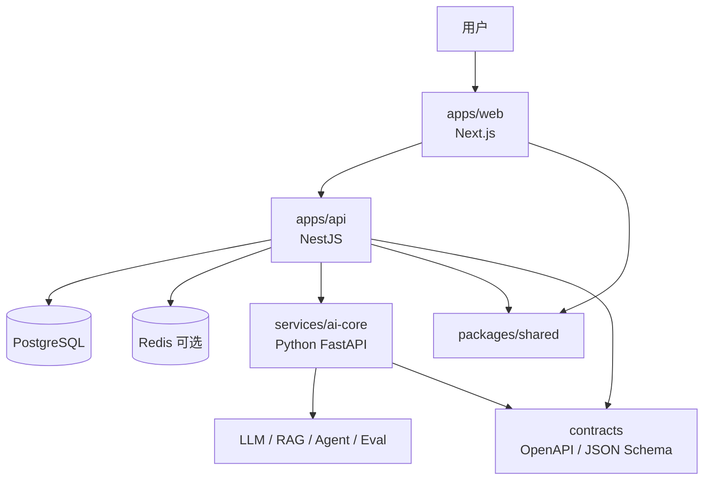

# 架构与正式技术选型

## 1. 结论先说

当前项目更适合采用：

- 前端：Next.js + TypeScript
- API / BFF：NestJS + TypeScript
- AI Core：Python + FastAPI
- 共享契约：TypeScript Shared Package + OpenAPI / JSON Schema
- 主数据库：PostgreSQL
- 可选缓存 / 队列：Redis

这是一套“Web 与 AI 分栈，但通过明确契约解耦”的方案。

## 2. 为什么不是单一 Web 栈

这个项目的 AI 功能不是附属增强，而是主打能力与亮点能力。只用单一 Web 栈会有两个问题：

1. 会把 AI 核心能力错误地埋进 Web 工程里
2. 会压缩后续检索、评估、工作流、Agent、离线处理的扩展空间

所以更合理的长期方案是：

- Web 层保持 TypeScript，全栈协作顺畅
- AI 核心层使用 Python，保留 AI 生态与扩展性
- 两者通过清晰协议协作，而不是代码层强耦合

## 3. 模块拆分

### apps/web
负责：
- 首页
- 场景选择页
- 测评答题页
- 结果页
- 后续动作页
- 响应式交互体验

### apps/api
负责：
- 统一业务 API 对外出口
- 场景配置、题目配置读取
- 规则判断基础链路
- 聚合前端所需结果数据
- 调用 AI Core 服务并做容错、回退、缓存

### services/ai-core
负责：
- 风险解释生成
- 动作建议生成
- 场景扩展 / 题目建议
- 未来的检索、Embedding、RAG、Agent、Eval、离线分析

### packages/shared
负责：
- TS 类型定义
- 常量 / 枚举
- 前后端共享 DTO
- 契约工具函数

### contracts
负责：
- OpenAPI 文档
- JSON Schema
- 示例请求 / 响应
- 跨语言协议对齐

## 4. 核心边界

### 4.1 Web 与 API 的边界

前端不持有评分规则，不直接实现业务判断。
所有场景、题目、结果与 AI 能力都通过 API 层暴露。

### 4.2 API 与 AI Core 的边界

API 层负责业务编排与产品边界控制。
AI Core 负责 AI 主能力，但不应单独决定产品的业务规则边界。

### 4.3 AI Core 与产品规则的边界

可由 AI 参与：
- 风险解释
- 动作建议
- 文案生成
- 场景扩展建议

应保留在业务规则层：
- 产品范围边界
- 场景与题目基础配置
- 三档结果的主规则
- 对外结果结构与前端协议

## 5. 推荐目录结构

```text
code/
├─ apps/
│  ├─ web/
│  └─ api/
├─ services/
│  └─ ai-core/
├─ packages/
│  └─ shared/
├─ contracts/
├─ docs/
├─ scripts/
└─ README.md
```

## 6. 服务边界图



## 7. 当前仓库状态

代码仓库已经完成从旧骨架到新架构的迁移：

- 旧目录 `backend/ frontend/ ai/ shared/` 已退出主路径并移除
- `apps/web` 已作为前端正式目录
- `apps/api` 已作为 API / BFF 正式目录
- `services/ai-core` 已作为 AI Core 正式目录
- `packages/shared` 与 `contracts/` 已作为共享层与协议层正式目录

当前后续开发应直接基于新架构推进，而不是再回到旧目录思路。

## 8. MVP 实现顺序

### 第一阶段
- `apps/api` 输出场景列表、题目列表、提交测评接口
- `apps/web` 跑通首页 → 场景页 → 答题页 → 结果页

### 第二阶段
- `services/ai-core` 建立最小 Python 服务骨架
- 先接风险解释与建议生成

### 第三阶段
- 引入评估、检索、向量、缓存与异步任务
- 逐步把 AI 亮点能力做深
