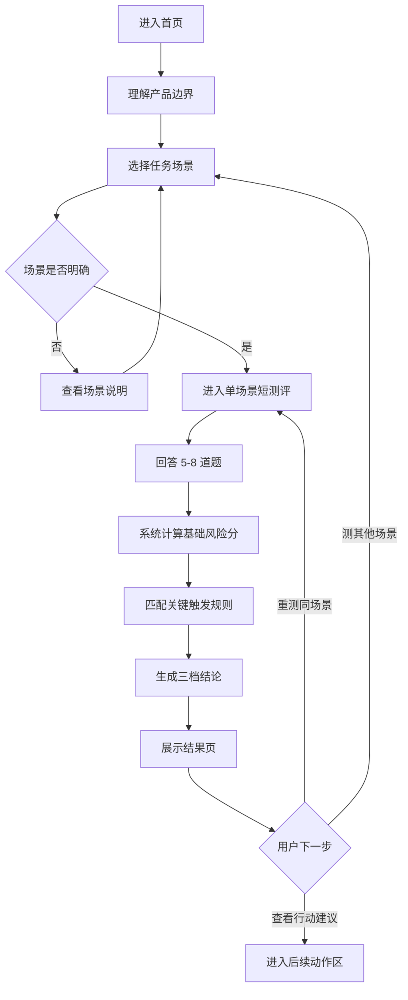
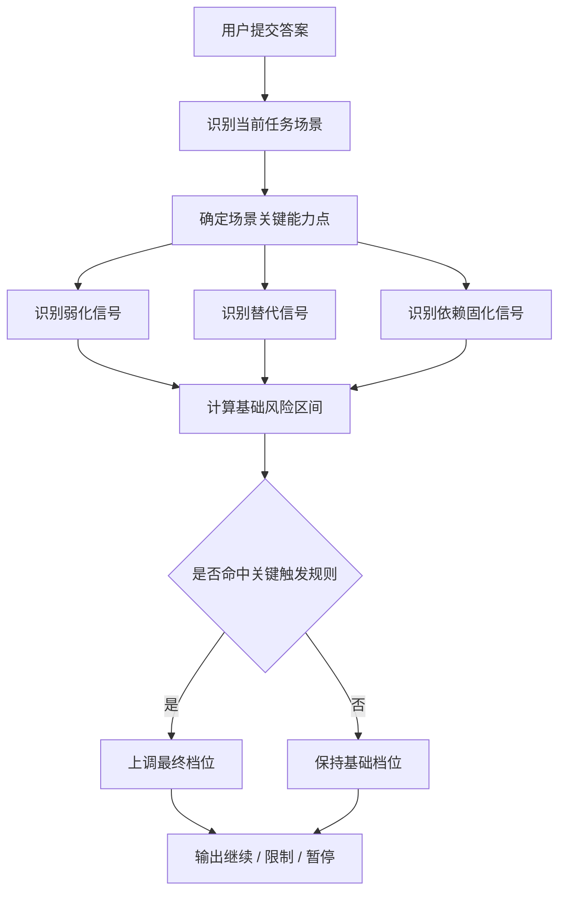
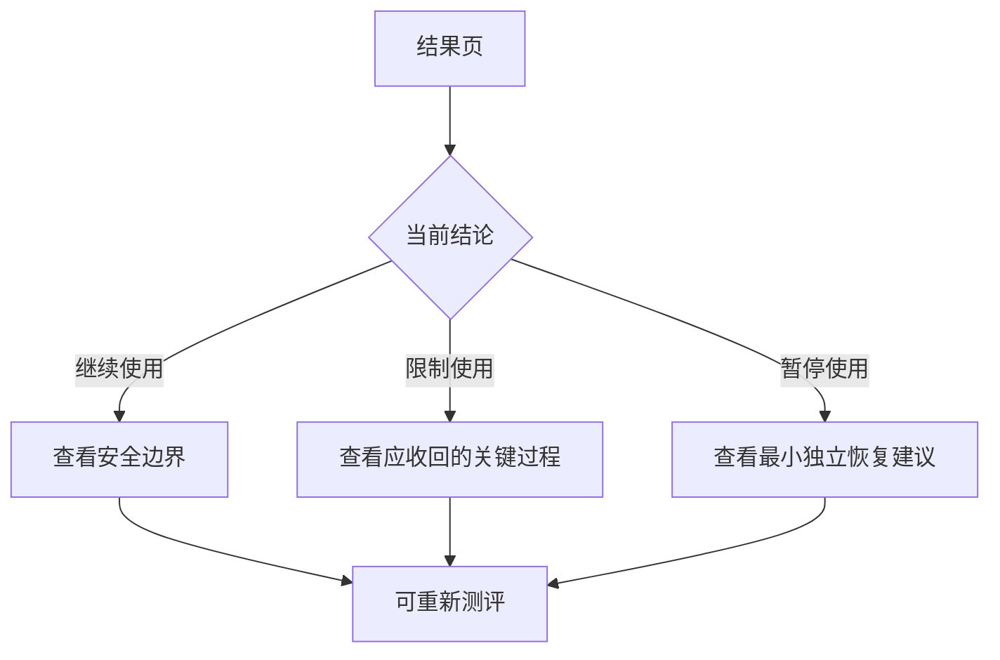

# 《是否应该继续使用 AI 完成当前工作》网页版 PRD / 页面结构 / 测评流程图 / 开发任务清单

## 0. 文档信息
- 关联主文档：`D:\UseAI_Benchmark\product-docs\ai-usage-product-doc-v1.md`
- 当前文档用途：把版本一主文档转成可落地的网页产品方案与开发拆解
- 目标形态：适配电脑、平板、手机三端的响应式网页
- 产品版本：Web V1 / MVP
- 更新时间：2026-04-23

---

## 1. PRD

### 1.1 产品定位
这是一个**任务级 AI 使用判断工具**，不是 AI 使用教学产品，也不是人格测评产品。它帮助用户围绕某一类具体任务，判断：在当前使用方式下，AI 还应继续辅助、需要限制，还是应阶段性暂停。

### 1.2 产品目标
网页版 V1 只验证四件事：
1. 用户是否存在“我现在还该不该继续这样用 AI”的真实判断需求。
2. 系统能否围绕单一任务场景，用短链路测评产出用户认可的结果。
3. 结果能否解释清楚风险来自哪里。
4. 结果能否推动用户调整真实使用方式。

### 1.3 非目标
本版明确不做：
- Prompt 能力评估
- AI 协作能力评估
- AI 输出验证能力评估
- 跨场景综合总评
- 长文本开放式测评
- 个性化训练营 / 成长体系 / 连续打卡
- 复杂图谱、排行榜、社交分享

### 1.4 核心用户问题
用户真正想知道的是：
- 我现在继续用 AI，到底是辅助，还是已经在替代我？
- 这类任务里，哪些部分我必须重新拿回自己做？
- 我现在应该继续、限制，还是暂停 AI 介入？

### 1.5 核心判断对象
`判断对象 = 某个用户 + 某类任务 + 当前使用方式`

系统始终输出**任务级结论**，不输出人格级结论。

### 1.6 MVP 支持的任务场景
第一版只开放 4 个场景：
1. 写作与汇报
2. 学习与资料整理
3. 基础编程
4. 基础数据处理

### 1.7 核心能力维度
网页端判断逻辑统一围绕以下 5 个维度：
1. 基础理解能力
2. 自主思考能力
3. 独立拆解与组织能力
4. 基础操作与执行能力
5. 初步判断与产出能力

### 1.8 核心判断逻辑
系统判断顺序固定为：
1. 先识别任务场景与任务敏感度
2. 再识别关键能力是否仍由用户承担
3. 最后识别 AI 是否已经越界进入首次理解 / 首次思考 / 首次拆解 / 首次产出
4. 综合输出三档结论：继续使用 / 限制使用 / 暂停使用

### 1.9 测评结构
每个场景控制在 5-8 题，优先采用单选 / 分级选择题，辅以少量情境题。

题目必须覆盖 5 类信息：
1. 起始方式
2. 关键过程承担
3. AI 介入位置
4. 脱离 AI 可完成度
5. 依赖惯性

### 1.10 结果结构
结果页固定输出 4 层信息：
1. 主结论：继续 / 限制 / 暂停
2. 原因解释：2-3 条风险来源
3. 保留能力：1-2 条仍在手里的能力
4. 调整建议：3 条下一步动作

### 1.11 成功指标
V1 不看花哨指标，优先看：
- 用户是否能快速理解产品在做什么
- 用户是否认可结果逻辑
- 用户是否愿意根据结果调整行为
- 四个场景能否稳定跑通“测评 → 判断 → 结果建议”链路

### 1.12 产品边界原则
必须始终遵守：
- 不把任务判断做成人格判断
- 不把风险提示做成道德训诫
- 不把结果包装成绝对真理
- 不偷渡“如何更好地使用 AI”的另一类产品逻辑

---

## 2. 页面结构

### 2.1 信息架构总览
网页版 MVP 建议收敛为 6 个页面/状态层：
1. 首页 / 入口页
2. 场景选择页
3. 场景说明浮层 / 抽屉
4. 测评答题页
5. 结果页
6. 后续动作页（或结果页内嵌动作区）

### 2.2 页面清单

#### 页面 A：首页 / 入口页
**目标**：校准预期，让用户理解这是任务判断，不是人格测试。  
**核心模块**：
- 顶部品牌区
- 一句话主标题
- 产品说明副标题
- 四类任务卡片预览
- 开始判断按钮
- 边界说明区（不是人格测试 / 不是教学工具）
- FAQ 简版入口

**关键文案方向**：
- 不是测你会不会用 AI
- 而是判断你在当前任务里还该不该继续这样用 AI

**三端布局建议**：
- 电脑：左右分栏，左侧价值说明，右侧场景卡片
- 平板：上下分区，场景卡片 2 列
- 手机：单列滚动，CTA 固定底部或首屏可见

#### 页面 B：场景选择页
**目标**：让用户明确当前判断的具体任务语境。  
**核心模块**：
- 返回入口
- 页面标题与说明
- 四类场景卡片
- 每个场景的“适用任务例子”
- 每个场景的“本场景主要判断什么”
- 进入测评按钮

**场景卡片字段建议**：
- 场景名
- 场景简介
- 典型任务举例
- 本场景重点保留能力

**三端布局建议**：
- 电脑：2×2 卡片栅格
- 平板：2 列卡片
- 手机：单列卡片 + 展开说明

#### 页面 C：场景说明浮层 / 抽屉
**目标**：避免用户选错场景。  
**打开时机**：点击“看看这个场景是否适合我”。  
**核心模块**：
- 适合什么任务
- 不适合什么任务
- 本场景重点能力
- 进入该场景测评 CTA

#### 页面 D：测评答题页
**目标**：在几分钟内完成单场景短测评。  
**核心模块**：
- 场景标题
- 当前进度（第 X / Y 题）
- 当前问题卡片
- 单选项区域
- 上一题 / 下一题
- 中途退出确认
- 页面底部边界提示：只针对当前任务，不评价你这个人

**题目呈现规则**：
- 一屏一题优先
- 题干必须具体，避免抽象问法
- 默认单选；少量情境题也保持单选
- 不做长文本输入

**三端布局建议**：
- 电脑：问题卡居中，宽度收敛，选项卡块式
- 平板：与电脑接近，但按钮更大
- 手机：全宽卡片，底部固定下一步按钮

#### 页面 E：结果页
**目标**：把判断转成可执行动作。  
**核心模块**：
- 主结论 Banner（继续 / 限制 / 暂停）
- 一句话解释
- 主要风险来源（2-3 条）
- 当前仍保有的能力（1-2 条）
- 下一步建议（3 条）
- 后续动作区
- 重新测评入口

**状态设计建议**：
- 继续：偏冷静安全色，不做“恭喜”式表达
- 限制：中性提醒色，突出边界开始失守
- 暂停：强调阶段性调整，不做负面羞辱感设计

#### 页面 F：后续动作页 / 结果页动作区
**目标**：给用户明确下一步，不让结果停在半空。  
**按结论分流**：
- 继续：查看安全使用边界 / 换场景重测
- 限制：查看应收回的关键过程 / 查看“先自己做再用 AI”的规则
- 暂停：查看应暂停 AI 的具体环节 / 查看最小独立恢复建议

### 2.3 全局公共模块
所有页面建议统一提供：
- 顶部导航（品牌、首页、重新开始）
- 轻量帮助入口
- 进度与状态反馈
- 响应式容器
- 可访问性支持（键盘可操作、语义标签、足够点击区）

### 2.4 三端适配原则

#### 电脑端（≥ 1280）
- 采用内容居中 + 分栏布局
- 结果页可以左右分区：左边结论，右边原因与建议
- 场景页用卡片栅格提升浏览效率

#### 平板端（768 - 1279）
- 保留栅格，但减少并列信息密度
- 场景卡片优先 2 列
- 结果页改成上下分区，减少左右切换

#### 手机端（≤ 767）
- 单列滚动
- CTA 固定到底部或紧跟首屏
- 题目一屏一题，减少视觉噪音
- 结果页先结论，再原因，再建议，严格控制信息顺序

### 2.5 页面状态与异常状态
需要补齐这些状态：
- 加载中
- 无答案不可下一步
- 提交计算中
- 结果生成失败
- 网络异常重试
- 用户中断后重新进入提示

---

## 3. 测评流程图

### 3.1 主流程图


### 3.2 判断逻辑流程图


### 3.3 结果分流流程图


---

## 4. 前后端实现建议

### 4.1 推荐实现拆分
为了让网页版先跑起来，建议采用：
- 前端：响应式 Web 页面、题目交互、结果展示
- 后端：场景配置、题库配置、评分规则、结果生成接口
- 配置层：题库 JSON / 场景配置 / 评分规则配置化

### 4.2 数据对象建议

#### 场景对象 `Scene`
- `id`
- `name`
- `slug`
- `summary`
- `examples`
- `focusCapabilities`
- `enabled`
- `sortOrder`

#### 题目对象 `Question`
- `id`
- `sceneId`
- `type`（single_choice / scenario_choice）
- `category`（起始方式 / 关键过程 / 介入位置 / 可完成度 / 依赖惯性）
- `title`
- `description`
- `options[]`
- `weight`
- `isHighWeight`
- `sortOrder`
- `enabled`

#### 选项对象 `Option`
- `id`
- `label`
- `riskLevel`
- `riskScore`
- `signals[]`（weakening / replacement / dependency）
- `triggerTags[]`

#### 结果对象 `AssessmentResult`
- `sceneId`
- `baseRiskScore`
- `triggeredRules[]`
- `finalLevel`（continue / limit / pause）
- `riskReasons[]`
- `retainedCapabilities[]`
- `actionSuggestions[]`

### 4.3 接口建议

#### 1）获取场景列表
`GET /api/assessment/scenes`

#### 2）获取某场景测评题目
`GET /api/assessment/scenes/{sceneId}/questions`

#### 3）提交测评答案并获取结果
`POST /api/assessment/submit`

请求体示例：
```json
{
  "sceneId": "writing-report",
  "answers": [
    { "questionId": "q1", "optionId": "q1_c" },
    { "questionId": "q2", "optionId": "q2_b" }
  ]
}
```

返回体示例：
```json
{
  "finalLevel": "limit",
  "baseRiskScore": 68,
  "triggeredRules": ["first_process_replaced", "dependency_signal_detected"],
  "riskReasons": [
    "你越来越依赖 AI 帮你启动第一步",
    "AI 已开始进入结构组织或第一版产出"
  ],
  "retainedCapabilities": [
    "你仍能完成局部修改",
    "你仍保留部分任务理解能力"
  ],
  "actionSuggestions": [
    "先自己完成首轮理解和结构，再使用 AI",
    "把 AI 限制在润色、检查、补充环节",
    "缩减对第一版生成的依赖"
  ]
}
```

#### 4）获取结果对应动作建议详情
`GET /api/assessment/follow-up/{level}?sceneId=xxx`

---

## 5. 前端任务清单

> 原则：按可独立实现的功能模块拆分，优先支持 MVP 跑通。

### FE-01：首页 / 入口页搭建
**描述**：实现产品首页，完成产品定位说明与主 CTA。  
**验收标准**：
- 能清楚表达“这是任务判断，不是人格测试”
- 首页首屏有明确开始入口
- 电脑 / 平板 / 手机三端可正常浏览

### FE-02：场景选择页搭建
**描述**：实现四类场景选择与场景卡片展示。  
**验收标准**：
- 4 个场景卡片完整展示
- 每个场景包含简介与示例任务
- 用户可进入对应场景测评

### FE-03：场景说明浮层 / 抽屉
**描述**：补充场景适用范围说明，减少误选。  
**验收标准**：
- 每个场景可展开查看详细说明
- 包含适合 / 不适合任务示例
- 手机端交互不拥挤

### FE-04：测评答题页骨架
**描述**：实现单场景短测评答题体验。  
**验收标准**：
- 一次展示一题
- 支持单选作答
- 支持上一题 / 下一题
- 未作答时不可进入下一题

### FE-05：测评进度与状态反馈
**描述**：补充答题进度条、退出确认、加载反馈。  
**验收标准**：
- 用户能看到当前第几题 / 总题数
- 中途退出有确认提示
- 提交时有明确加载状态

### FE-06：结果页三档状态 UI
**描述**：实现继续 / 限制 / 暂停三种结果展示模板。  
**验收标准**：
- 主结论、一句话解释、风险来源、保留能力、建议都能展示
- 三种状态视觉有区分，但不过度情绪化
- 手机端结果层级清晰

### FE-07：后续动作区与重测入口
**描述**：实现结果后的下一步动作入口。  
**验收标准**：
- 不同结论可展示不同动作按钮
- 支持重新测评当前场景
- 支持返回场景选择页

### FE-08：响应式适配收口
**描述**：统一处理电脑 / 平板 / 手机布局和交互细节。  
**验收标准**：
- 三端主要页面布局无错位
- 触控点击区满足移动端使用
- 文字、间距、按钮在各端可读可用

### FE-09：异常状态与容错提示
**描述**：补齐加载失败、网络错误、接口异常等状态。  
**验收标准**：
- 接口失败时有友好提示
- 支持重试
- 不会因为异常导致页面卡死

### FE-10：可访问性与基础体验优化
**描述**：补齐语义标签、焦点态、键盘操作等基础可访问性。  
**验收标准**：
- 主要按钮和选项可键盘访问
- 表单语义明确
- 颜色与对比度满足基础可读性

---

## 6. 后端任务清单

### BE-01：场景配置数据结构落地
**描述**：建立场景配置表或配置文件结构。  
**验收标准**：
- 可配置 4 个首批场景
- 每个场景包含名称、说明、示例任务、重点能力字段
- 前端可通过接口读取

### BE-02：题目配置数据结构落地
**描述**：建立题目、选项、风险标签、权重配置结构。  
**验收标准**：
- 每个场景可配置 5-8 题
- 每题可配置权重、风险分、信号标签
- 支持后续增删题目而不改核心代码

### BE-03：获取场景列表接口
**描述**：输出场景选择页所需数据。  
**验收标准**：
- 返回结构稳定
- 支持场景启停
- 返回顺序可配置

### BE-04：获取题目列表接口
**描述**：输出某场景测评题目与选项。  
**验收标准**：
- 仅返回当前场景题目
- 返回顺序正确
- 不泄露不必要的评分规则内部字段

### BE-05：基础风险分计算器
**描述**：实现基于选项风险分和权重的基础评分。  
**验收标准**：
- 支持普通题 / 高权重题
- 计算逻辑稳定可复现
- 输出基础风险分与基础区间

### BE-06：关键触发规则引擎
**描述**：实现首次过程被接管、无法离开 AI 完成最小版本、替代 + 依赖同时出现等触发规则。  
**验收标准**：
- 规则可配置
- 命中规则时可上调最终档位
- 能返回命中的规则标识

### BE-07：结果生成器
**描述**：根据场景、风险信号和最终档位输出结果内容。  
**验收标准**：
- 可生成主结论、风险来源、保留能力、行动建议
- 输出内容是任务级，不带人格评价
- 不出现越界文案

### BE-08：提交测评接口
**描述**：接收答案并返回最终结果。  
**验收标准**：
- 参数校验完整
- 非法 questionId / optionId 会被拦截
- 正常返回结果结构

### BE-09：结果动作详情接口
**描述**：按结论档位和场景返回对应后续动作说明。  
**验收标准**：
- 不同场景、不同档位可返回不同动作内容
- 支持继续扩展后续动作模板

### BE-10：内容边界审查与配置校验
**描述**：为结果文案和题目配置增加边界检查。  
**验收标准**：
- 能识别人格化 / 道德化 / 越界教学式文案
- 配置发布前可校验高风险文案
- 防止内容偏离主文档边界

---

## 7. 联调顺序建议
1. 先完成场景配置 + 题目配置
2. 前端先用 mock 数据跑通首页 / 场景页 / 测评页 / 结果页
3. 后端补齐场景接口 / 题目接口 / 提交接口
4. 联调评分与结果生成
5. 最后统一做三端适配、异常状态和可访问性收口

---

## 8. 建议的 MVP 开发顺序

### 第一阶段：先跑通最小闭环
- 首页
- 场景选择页
- 单场景题目
- 提交答案
- 结果页

### 第二阶段：补齐可用性
- 四个场景全量接入
- 结果页动作区
- 异常状态
- 三端响应式

### 第三阶段：补齐稳定性
- 配置化评分规则
- 配置校验
- 内容边界检查
- 埋点与结果验证指标

---

## 9. 交付结论
如果只按当前主文档做 Web V1，最合理的产品形态就是：

- **产品上**：单场景、短链路、三档结论、可执行建议
- **页面上**：首页 → 场景选择 → 测评答题 → 结果页 → 后续动作
- **交互上**：电脑、平板、手机三端统一一套逻辑，不同布局密度
- **开发上**：前端负责响应式交互与结果呈现，后端负责场景配置、题目配置、评分规则和结果生成

一句话收住：**先把“任务级 AI 使用判断”这个闭环网页做对，再考虑变成更大的系统。**
